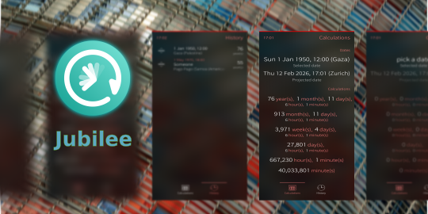

<!--
SPDX-FileCopyrightText: 2018-2026 Mirian Margiani
SPDX-License-Identifier: GFDL-1.3-or-later
-->

# Jubilee for Sailfish OS

Jubilee calculates your next anniversary.

Do you know if you are 10'000 days old?

Do you want to surprise your friends with a party for their 2'500 week anniversary?

With this app, you can quickly calculate an age in years, weeks, days, minutes, and
seconds at any given date. How old are you *right now*? When is the next anniversary?

This app is inspired by [Age Calculator](https://github.com/Mariusmssj/harbour-age_calculator)
with added support for time zones, calculating specific dates, and a history view.

## Help and support

You are welcome to [leave a comment in the forum](https://forum.sailfishos.org/t/apps-by-ichthyosaurus/15753)
if you have any questions or ideas.

## Translations

It would be wonderful if the app could be translated in as many languages as possible!

Translations are managed using
[Weblate](https://hosted.weblate.org/projects/harbour-jubilee/translations).
Please prefer this over pull request (which are still welcome, of course).
If you just found a minor problem, you can also
[leave a comment in the forum](https://forum.sailfishos.org/t/apps-by-ichthyosaurus/15753)
or [open an issue](https://codeberg.org/ichthyosaurus/harbour-jubilee/issues/new).

Please include the following details:

1. the language you were using
2. where you found the error
3. the incorrect text
4. the correct translation

### Manually updating translations

Please prefer using
[Weblate](https://hosted.weblate.org/projects/harbour-jubilee) over this.
You can follow these steps to manually add or update a translation:

1. *If it did not exist before*, create a new catalog for your language by copying the
   base file [translations/harbour-jubilee.ts](translations/harbour-jubilee.ts).
   Then add the new translation to [harbour-jubilee.pro](harbour-jubilee.pro).
2. Add yourself to the list of translators in [TRANSLATORS.json](TRANSLATORS.json),
   in the section `extra`.
3. (optional) Translate the app's name in [harbour-jubilee.desktop](harbour-jubilee.desktop)
   if there is a (short) native term for it in your language.

See [the Qt documentation](https://doc.qt.io/qt-5/qml-qtqml-date.html#details) for
details on how to translate date formats to your *local* format.

## Building and contributing

*Bug reports, and contributions for translations, bug fixes, or new features are always welcome!*

1. Clone the repository by running `git clone https://codeberg.org/ichthyosaurus/harbour-jubilee.git`
2. Open `harbour-jubilee.pro` in Sailfish OS IDE (Qt Creator for Sailfish)
3. To run on emulator, select the `i486` target and press the run button
4. To build for the device, select the `aarch64` or `armv7hl` target and click “deploy all”;
   the RPM packages will be in the `RPMS` folder

If you contribute, please do not forget to add yourself to the list of
contributors in [qml/pages/AboutPage.qml](qml/pages/AboutPage.qml)!

## Donations

If you want to support my work, I am always happy if you buy me a cup of coffee
through [Liberapay](https://liberapay.com/ichthyosaurus).

Of course it would be much appreciated as well if you support this project by
contributing to translations or code! See above how you can contribute 🎕.

## Anti-AI policy <a id='ai-policy'/>

AI-generated contributions are forbidden.

Please be transparent, respect the Free Software community, and adhere to the
licenses. This is a welcoming place for human creativity and diversity, but
AI-generated slop is going against these values.

Apart from all the ethical, moral, legal, environmental, social, and technical
reasons against AI, I also simply don't have any spare time to review
AI-generated contributions.

## License

> Copyright (C) 2026  Mirian Margiani

Jubilee is Free Software released under the terms of the
[GNU General Public License v3 (or later)](https://spdx.org/licenses/GPL-3.0-or-later.html).
The source code is available [on Codeberg](https://codeberg.org/ichthyosaurus/harbour-jubilee).
All documentation is released under the terms of the
[GNU Free Documentation License v1.3 (or later)](https://spdx.org/licenses/GFDL-1.3-or-later.html).

This project follows the [REUSE specification](https://api.reuse.software/info/codeberg.org/ichthyosaurus/harbour-jubilee).
